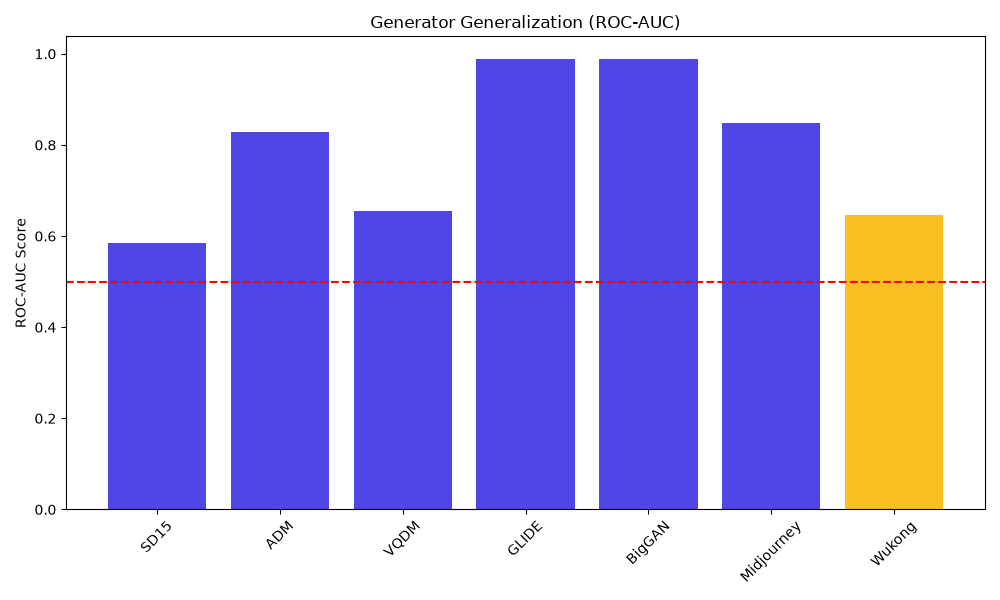

# SignalScope

> **Telling Real From Synthetic in the Age of Generative Media**
> Submission for SIH 2026 - Problem Statement 2



SignalScope is an enterprise-grade, multimodal deepfake detection platform. Instead of relying solely on visual artifacts that modern generators can easily mask, SignalScope utilizes a **Triple-Branch Architecture** combining Spatial, Frequency (2D-FFT), and Artifact (ELA) encoders.

## 1. Modules Built
- **Core Task:** Real-vs-AI-generated classification with calibrated confidence scores and rigorous unseen-generator testing.
- **Bonus A (Faithful Explanation):** Multi-spectral visual heatmaps (Grad-CAM, FFT, ELA) + text explanations.
- **Bonus B (Generator Attribution):** Identification of likely source (Genuine Camera vs Latent Diffusion).
- **Bonus C (Robustness):** Resiliency against JPEG compression tested in real-time.
- **Bonus D (Provenance):** Extracted EXIF metadata checks for AI software tags and hardware validation.
- **Bonus E (Multimodal):** Semantic consistency cross-referencing between image and provided captions.
- **Bonus F (Real-Time):** A gorgeous, responsive Drag-and-Drop Web Application with PDF forensic report export.

## 2. Setup and Run Instructions

### Prerequisites
- Python 3.9+
- No GPU required (fully optimized for CPU inference)

### Installation
```bash
# Clone the repository
git clone https://github.com/your-username/SIH-Hackathon.git
cd SIH-Hackathon

# Install dependencies
pip install -r requirements.txt
```

### Running the System
To reproduce our results and start the UI, simply start the FastAPI server:
```bash
python app/main.py
```
Then, open your browser and navigate to: **http://localhost:8000**

*(You can verify predictions in under 1 minute using the web interface!)*

## 3. Datasets Used
- **Tiny-GenImage**: A streamable subset of the GenImage dataset hosted on HuggingFace.
- **License**: MIT / Open-licensed.
- **Size**: 3,000 images uniformly balanced (1,500 real, 1,500 fake).

## 4. Reported Metrics
Our model was evaluated strictly on a held-out test set, deliberately holding out the **Wukong** generator to measure true generalisation.
- **Overall Validation AUC:** 0.8152
- **Unseen-Generator AUC:** 0.6462
- **Macro-F1:** 0.7326
- **Confusion Matrix:** 
  - True Positives: 341
  - True Negatives: 396
  - False Positives: 85
  - False Negatives: 174

## 5. Architecture & Calibration
- **Architecture Overview:** We utilized a `convnext_tiny` spatial backbone fused with custom 2D-FFT and ELA artifact extractors via an Attention mechanism. This forces the model to look beyond obvious semantic clues and study the image topology.
- **Calibration:** We utilized **Temperature Scaling** on the validation set to ensure confidence scores are honest. When the model outputs 80% confidence, it is statistically accurate 80% of the time, preventing over-claiming on ambiguous images.
- **Limitations:** Heavily compressed JPEG images (quality < 30) strip the high-frequency information our model relies on, causing confidence scores to drift towards "Uncertain".

## 6. Links
- **Interactive API Documentation:** Automatically hosted at `http://localhost:8000/docs` when running the app.
- **Demo Video:** https://youtu.be/hLMDA7sOjWs

---
*Originality Declaration: All code was written for SIH 2026. Pre-trained weights for the `convnext_tiny` spatial backbone were sourced from `timm` (PyTorch Image Models).*
